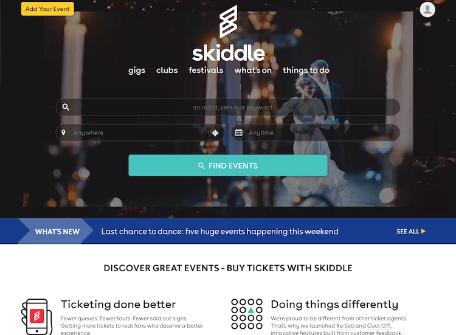

# Research

## eventbrite

[Visit eventbrite](https://www.eventbrite.co.uk/)

Event bright is a popular event website with bright colours and many features to search events.

Likes:
* Categories for each event.
* Big banner photo on event details.

    
    * "Ticket sales end soon" - creates sense of urgency.
* Get tickets is always visible, reduces steps needed to get tickets

    

Dislikes:
* Sometimes too overcrowded for some screen sizes

## Skiddle

[Visit Skiddle](https://www.skiddle.com/)

Skiddle is another very popular event website, that is independant.

Likes:
* Very busy homepage - fits the feel of the events listed (video banner).
* Call to action "Add Your Event" for event hosts.
* Instant search functionality on banner for keywords, location and calendar.
* Clicking on Skiddle led me to the Liverpool homepage because that's where I am currently.

    
    * Nice clear categories along the bottom
    * Clear keyword, calendar and location (filled out with current location) that isn't overcrowded.
* Explore by city or genre

    
    * Simple tiles, fit for purpose and lots of space.

Dislikes:
* Text not easy to read on video banner