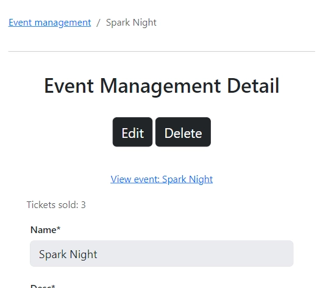
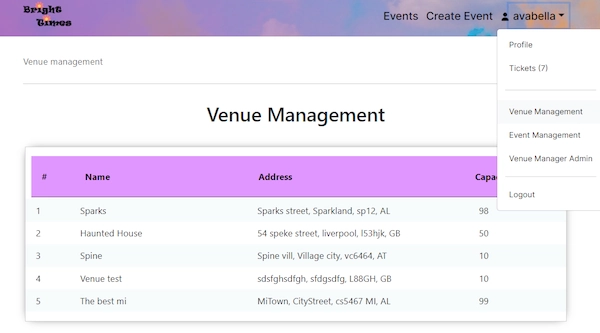

# Bright Times - Milestone Project 4

Bright Times is a platform for exploring and keeping up-to-date on new and upcoming events. 

This project demonstrates my ability to create a full-stack application with eCommerce functionality. It uses the Django framework along with HTML5, CSS3, JavaScript and of course Python. I also use SQL to manage the database.

[View the live project here](https://your-bright-times-547094b0ac48.herokuapp.com/)


## Technologies used

### Languages used

* HTML5
* CSS3
* JavaScript
* Python

### Frameworks, Libraries & Programs Used

* JQuery datetimepicker plugin
* [JQuery.visible plugin](https://github.com/customd/jquery-visible)
  * Allows you to detect if the element is visible.
  * I use this to set the Django messages container position to fixed when scrolled out of view.
* boto3
  * To interact with AWS S3 bucket.
* django-allauth
  * User authentication, registration and management.
  * To send and manage emails.
* Stripe
  * To implement the card payment system. 
* djlint 
  * For django-html auto-formatting.
* Django 5
  * Full Python framework.
* Bootstrap 5
  * CSS framework
* autopep8 extension/package
  * Package to automatically format to PEP8 standards.
* Google Fonts
* Easy access to many fonts supplied from a CDN that is close to the user, increasing download speed.
* Font Awesome
  * Professional icons
* Git 
  * Used for version control.
* GitHub
  * Used to store commits.
* Heroku
  * Hosts the live project.
* Visual Studio Code
  * Used as the IDE for the project.
  * I set a shortcut for Visual Code to format HTML/CSS/JS (ctrl+shift+f).
    * This also worked for Python after installing autopep8.
* Paint.NET
  * Used to edit images for the project.
* Figma
  * Used to create the mockup of the website before developing.
* Lucid.app
  * Used to create an Entity Relationship Diagram to model the data.
* Word 
  * Used to present the project requirements in my own words, for project research, and brainstorming.
* Notepad and Notepad++
  * Used for quick notes from my mentor and for notes while developing.
  * Used for planning.
* Chrome - Inspect element
  * This was used to:
    * Style the website and test new ideas to be copied into the project.
    * Continuously test responsiveness by adjusting the screen size and by testing preset device dimensions.
    * Bug fix.
* Firefox, Microsoft Edge, Safari
  * Used to test compatibility on other browsers.
* [Responsinator](http://www.responsinator.com/) for testing on different screens.
* [Grammarly](https://app.grammarly.com/)
  * To help find and correct grammar and spelling mistakes.

## User Experience (UX)

### Project Goals

This will be a website where you can discover an event that fits you. 

The audience is anyone who enjoys going to events but is going to have a majority of young adults. It appears to be common for the home button to be excluded in event websites as it's well known that the logo will take you to the homepage.

The project will be designed using the 5 planes of UX design. I will of course be taking a mobile-first approach. This is especially important for an events-based website, as users are more likely to be travelling while using it.

### Strategy Plane

The audience will be diverse as events can be targeted towards a wide range of people.

Bright Times will be an event directory where users can find events and pay for tickets.

**User goals:**
* Browse events
* View event details.
* Filter events by location.
* Buy tickets.
* Save events to view later.

**Site owner goals**
* Gain commission from ticket sales.
* Spread awareness of events.

#### Research

[Research conducted for this project can be found here](docs/research/Research.md)

### Scope Plane

Features to include:
* Login functionality - provided by alluth.
* Ability to save card details and address
* Users will be able to view their tickets.
* Users will be able to browse events, they will also be able to browse by location.

Future features:
* Recurring events.
* Notify users of upcoming events by email.
* Ability to subscribe to a reminder of an event.
* The ability to search events.
* Ability to view events relating to a specific venue.
* A category for events by location.

#### User stories


### Structure plane

I will include the following pages:
* Homepage
* Events pages
* Profile page

Under the header, there will be hierarchical navigation.

#### Data model

You can view my [Entity Relationship diagram on lucid chart here](https://lucid.app/lucidchart/f61018a0-575d-4ff6-9d12-8b56e48e9e94/edit?viewport_loc=-529%2C-519%2C2828%2C1231%2C0_0&invitationId=inv_a3700010-1732-4eac-8bfb-6a86e7ff4a7a)

##### User and User Profile

These two models have a one-to-one relationship. A user profile model instance is created when a user is created. This is done using a signal on post_save.

A user profile contains the first name, last name and Stripe customer ID of a user. This information is saved when it is inputted to create a ticket order.
The first and last names can also be added beforehand.

##### Venue and Address

A venue is managed by the user who created it. Upon creation, the user is added with the venue ID to a new venue manager instance.

Venue contains an Address foreign key.
I decided to separate the address from the Venue to better organise the data. I considered a one-to-one relationship, however, a one-to-many relationship would enable a different venue under the same address to use the existing address record. Therefore, it allows for the future introduction of this feature. While acknowledging that this is a rare case, this would avoid duplicate address records.

##### Venue Manager

Django doesn't support composite primary keys so the junction table VenueManager still has a primary key. I have set the meta so that the combination of User ID and Venue ID is unique. The primary key will be useful for indexing in future anyway.
This will allow me to filter by userID and VenueID and get a result as if using a composite ID.

##### Event

An event contains the foreign keys to a:
* Venue
* Venue manager

The original idea was to use ID as the value for the event's created_by. If you wanted the venue manager, you just use the user ID. However, a user can also have a ticket and therefore I believe it makes it more clear if created_by is set to the venue manager who created the event.

An event also contains the fields:
* Name - The name/title of the event.
* Description - A short description of the event.
* About - The main content of the event.
* Price - The price of the event
  * I considered adding price to the Ticket model. This would allow for discounts.
  * I decided that for the scope of this project, the event model containing the price sufficed.
* Image URL - The URL of the image stored in the media folder.
* Created on - Automatically upon event creation.
* Ticket end date/time - Datetime that the sale of tickets end
* Start and end date/time - One field for the start date/time and one for the end date/time 

##### Ticket

A ticket is a junction table between an event and a user.
It also contains the foreign key of a ticket order. Multiple tickets can be created under one order.

##### Ticket Order

* Ticket order has its primary key as a UUID. 
  * This makes guessing the checkout-success page URL practically impossible. 
  * A UUID is unique as it's mathematically impossible to get the same one twice. Although technically it is a non-zero chance.
* Order date.
  * Contains the date of creation. Useful information for the customer and debugging.
* Quantity and price redundancy.
  * Although this information is redundant, it will help debugging in future.
  * This way, the quantity and price will never change regardless of the event or ticket instances.
  * The information can be easily matched with the information on Stripe's end too.


**Future adaptations**

* Change the About field into a rich text field.
  * This will allow the user to add images and style their text.


### Skeleton plane

I decided to not separate Venue into its own app. This may be required in future if the Venue model becomes more complex. A venue is used to create an event.

A ticket is a simple model linking an event with a user. I have decided not to separate this either.

### Surface plane

I wanted to use a bright colour. Either yellow/orange to represent the sun or a calm blue to represent trust. 

[cvent - how to choose event website color:](https://www.cvent.com/en/blog/events/how-to-choose-event-website-color)
"Yellow. Bright and sunny, yellow is the color of optimism.
Green. This is the color of growth and health.
Blue. The color of trust, blue conveys tranquillity, serenity, and peace."

### Future improvements

* The datetime picker in event creation
  * A range picker for start and end event date/times.
  * A better validation message than an alert if the date/times are set.

# GitHub issues/project tab

I have added features that need to be implemented into the GitHub issues section on GitHub.

This helps me track what needs to be done and add any bugs that I notice to be actioned later.

[You can view this by clicking here](https://github.com/avabellaw/bright-times/issues)

# Stripe payments

**The confirmation of payment email is only sent when using a live stripe key**

I followed the Stripe documentation and a guide by testdriven as [mentioned in the code credits](#Code).

I also used the walkthrough project for additional guidance.

A PaymentIntent is created containing the customer ID of either an existing customer or a newly created one.
The customer object contains the email for the receipt. The receipt will only be sent once Stripe is set to live mode.

The Stripe PaymentIntent is also created with a description of the ticket ordered and quantity. 

When the stripe payment is completed, the return URL is for the create_order view. This confirms the payment intent and ensures it has not already been created. It then creates the order and the tickets associated with it.

Quantity, price and total price are added to the TicketOrder model. This is redundant information but is useful for debugging in future.
If an order were to go wrong, you would have the quantity and price of the ticket at order creation.
The order total also adds a level of redundancy that can cover future mistakes or bugs. It ensures that the system's information will match up with the Stripe records in one way or another. Order total is also useful for auditing data or creating reports.

# Security features

* I have added a CSP policy to help protect against cross-site scripting attacks using django-csp.
* All passwords are stored in the database as their hashed versions.
* Users have to verify their email before buying a ticket.
* Users have to use a strong password.

# Testing

## Code validation

### JavaScript validation using [JSHint](https://jshint.com/) and [JSLint](https://www.jslint.com/) 

I will be dismissing JSLint errors relating to JQuery.

<details>
<summary>JavaScript validation results</summary>

| JS filename              | Results         | App name     | Comments                          |
|--------------------------|-----------------|-------------|-----------------------------------|
| scroll-events.js         | Passed          | events      |                                   |
| management-detail.js     | Passed          | managemnet  |                                   |
| sticky-django-messages.js| Passed          | Root        |                                   |
| checkout.js              | Passed          | tickets     | I'm ignoring the line too long message for return_url. I've also not alphabetized the names of properties as the order makes logical sense.                 |
| update-total-cost.js     | Passed          | tickets     |                                   |

</details>

### CSS validation using [W3C Validation Service](https://jigsaw.w3.org/css-validator/)

| CSS filename              | Results       | App name | Link to results                         |
|---------------------------|---------------|----------|-----------------------------------------|
| styles.css                 | Passed        | root     | [View results](https://jigsaw.w3.org/css-validator/validator?uri=https%3A%2F%2Fyour-bright-times.s3.amazonaws.com%2Fstatic%2Fcss%2Fstyles.css&profile=css3svg&usermedium=all&warning=1&vextwarning=&lang=en) |
| event-card-styles.css     | Passed        | events   | [View results](https://jigsaw.w3.org/css-validator/validator?uri=https%3A%2F%2Fyour-bright-times.s3.amazonaws.com%2Fstatic%2Fevents%2Fcss%2Fevent-card-styles.css&profile=css3svg&usermedium=all&warning=1&vextwarning=&lang=en) |
| event-styles.css     | Passed        | events   | [View results](https://jigsaw.w3.org/css-validator/validator?uri=https%3A%2F%2Fyour-bright-times.s3.amazonaws.com%2Fstatic%2Fevents%2Fcss%2Fevent-styles.css&profile=css3svg&usermedium=all&warning=1&vextwarning=&lang=en) |
| styles.css     | Passed        | management   | [View results](https://your-bright-times.s3.amazonaws.com/static/management/css/styles.css) |
| styles.css     | Passed        | tickets   | [View results](https://jigsaw.w3.org/css-validator/validator?uri=https%3A%2F%2Fyour-bright-times.s3.amazonaws.com%2Fstatic%2Ftickets%2Fcss%2Fstyles.css&profile=css3svg&usermedium=all&warning=1&vextwarning=&lang=en) |
| checkout.css   | Passed       | tickets      | [View results](https://jigsaw.w3.org/css-validator/validator?uri=https%3A%2F%2Fyour-bright-times.s3.amazonaws.com%2Fstatic%2Ftickets%2Fcss%2Fcheckout.css&profile=css3svg&usermedium=all&warning=1&vextwarning=&lang=en) |
| checkout-success.css | Passed | tickets      | [View results](https://jigsaw.w3.org/css-validator/validator?uri=https%3A%2F%2Fyour-bright-times.s3.amazonaws.com%2Fstatic%2Ftickets%2Fcss%2Fcheckout-success.css&profile=css3svg&usermedium=all&warning=1&vextwarning=&lang=en) | 
| user-tickets.css    | Passed | tickets      | [View results](https://jigsaw.w3.org/css-validator/validator?uri=https%3A%2F%2Fyour-bright-times.s3.amazonaws.com%2Fstatic%2Ftickets%2Fcss%2Fuser-tickets.css&profile=css3svg&usermedium=all&warning=1&vextwarning=&lang=en)| 

### HTML validation using [W3C Validation Service](https://validator.w3.org/)

| HTML filename       | Results       | App name | Comments     | Link to results                         |
|---------------------|---------------|----------|-----------------------------------------|--------------|
| index.html          | Passed        | home     | No warnings  | [View results](https://validator.w3.org/nu/?showsource=yes&doc=https%3A%2F%2Fyour-bright-times-547094b0ac48.herokuapp.com%2F) |
| base.html           | Passed        | root     | This is validated on every page as it's the base template. I had to add the nav background image as an inline style here to keep the image address dynamic. |
| All toasts          | Passed        | root     | I have validated all the HTML files under the toast directory through direct input ||
| logout.html         | Passed        | allauth_override | | [View results](https://validator.w3.org/nu/?showsource=yes&doc=https%3A%2F%2Fyour-bright-times-547094b0ac48.herokuapp.com%2Faccounts%2Flogout%2F)|
| login.html          | Passed        | allauth_override | Have to be logged out. Originally got one error as the passwords aria-describedby ID didn't match up. This is because crispy forms change the ID of helptext. I fixed this by overriding the form and updating the aria-describedby ID attribute. | [View results](https://validator.w3.org/nu/?showsource=yes&doc=https%3A%2F%2Fyour-bright-times-547094b0ac48.herokuapp.com%2Faccounts%2Flogin%2F) |
| signup.html        | Passed with 1 error        | allauth_override | Must be logged out. Fixed the same aria-describedby error as login.html. There is 1 error because crispy_forms adds a ul as a child of a small element. | [View results](https://validator.w3.org/nu/?showsource=yes&doc=https%3A%2F%2Fyour-bright-times-547094b0ac48.herokuapp.com%2Faccounts%2Fsignup%2F) |
| email.html         | Passed        | allauth_override | This is allauth code but I removed the type="text/javascript" | Direct input |
| events.html        | Passed        | events           | | [View results](https://validator.w3.org/nu/?doc=https%3A%2F%2Fyour-bright-times-547094b0ac48.herokuapp.com%2Fevents%2F) |
| event-card.html    | Passed        | events           | This is validated as it's apart of the events page | N/A
| event-details.html | Passed        | events           || [View results](https://validator.w3.org/nu/?doc=https%3A%2F%2Fyour-bright-times-547094b0ac48.herokuapp.com%2Fevents%2Fevent-details%2F1%2F0) |
| choose-or-create-venue.html  | Passed        | events           || [View results](https://validator.w3.org/nu/?doc=https%3A%2F%2Fyour-bright-times-547094b0ac48.herokuapp.com%2Fevents%2Fchoose-or-create-venue%2F) |
| create-event.html  | Passed        | events           || Direct input |
| base.html          | Passed        | events           | This is validated as it's part of all events pages| N/A|
| base.html & detail-base.html & management-base.html | Passed | management | All validated as they are the base for the respective management pages | N/A |
| event-management.html | Passed | management | | [View results](docs/validation/html/event-management.webp) |
| event-detail.html | Passed | management | Had to update forms.py and management-detail.js to stop adding readonly to file input fields | [View results](docs/validation/html/event-management-detail.webp) |
| venue-management.html | Passed | management | Had to remove scope="row" | [View results](docs/validation/html/venue-management.webp) |
| venue-detail.html | Passed | management || [View results](docs/validation/html/venue-management-detail.webp) |
| venue-manager-admin.html | Passed | management || [View results](docs/validation/html/venue-manager-admin.webp) |
| venue-manager-detail.html | Passed | management || [View results](docs/validation/html/venue-manager-detail.webp) |
| delete-confirmation.html | Passed   | allauth_override | This is validated with the management templates ||
| buy-ticket.html | Passed | tickets || [View results](docs/validation/html/buy-ticket.webp) |
| checkout.html | Passed apart from Stripe.js HTML errors | tickets || [View results](docs/validation/html/checkout.webp) |
| checkout-success.html | Passed | tickets || [View results](docs/validation/html/checkout-success.webp) |
| user-tickets.html | Passed | tickets || [View results](docs/validation/html/user-tickets.webp) |
| profile.html      | Passed | user-profile || [View results](docs/validation/html/user-profile.webp) |

### Python validation

* I used the extension Flake8 to persistently validate my Python code to PEP8 standards.
* I used autoPEP8 to automatically format files.
* I added "editor.rulers": [79]," to vscode's settings.json file. This displayed a ruler line where the character limit hit 79 characters.

**Flake8 results**


## Automatic tests

It's especially important to have a test-driven approach when creating automatic tests. Creating the tests first ensures that the tests are going to work properly. I wrote a failing test, then wrote the code to get a passing test, and lastly optimised the test by exploring ways the test could fail.

**Events**

I tested:
* User can create an Event.
* Access to event creation page.
* Unauthorized access to the Event page.
* Whether the user is redirected to the login page

**Venues**

I tested:
* User can create a Venue.
* That a venue manager is created with a venue when created by a regular user.
* Venue manager is created with a venue when created by an admin.

## Manual testing

### Test plan

I have continually tested new features and repeatedly thought of ways I could break them after implementation. I've paid close attention to testing responsiveness as a webpage must look great on all devices.

The majority of the manual testing at the end of the project is through testing the user stories.

### Testing user stories

#### Events

**1. As a user, I want to view events to buy a ticket.**

The user can see events by clicking on the events tab.


A user can also see events on the homepage in categories.


**2. As a user I want to view event details**

Each event card has a stretched-link to allow them to view event details by clicking on it (unless clicking the buy ticket button).

In event details, the user will find all the important information about the event:
* Description 
* Date and time 
* Location 
* When tickets end
* How much tickets cost

 

A venue manager will also see a button allowing them to access the edit/delete event page.


**3. As a Venue manager, I want to list events for my venue so I can sell tickets**

Any venue manager can create an event from the venues they're managing.


**4. As a Venue manager, I want to see how many people have bought tickets so I can know how many people are coming**

In event management, a venue manager can see how many tickets have been sold.



**5. As a venue manager, I want to see if I'm the manager of an event so I can be reminded without looking at the event management page**


**6. As an owner or manager, I want to edit and delete events**

A venue manager owner or manager can go to the event management page from an event.


And then edit or delete them there.


A staff member cannot edit or delete events they don't own.


**7. As a staff-level venue manager, I want to edit and delete my own events**

This is a staff member's event that they created. They can edit and delete it.


#### Venues

**8. As an owner, I want to be able to create a venue, so I can create events from it**

Creating a venue will automatically make you an owner of it.

I tested that I could create a venue and then I created an event from it.

**9. As an owner, I want to edit and delete venues to keep them up-to-date**
**10. As an owner, I want to view a list of venues to manage them**




**11. As an owner, I want to set a venue capacity to sell tickets based on it**

I tested that I correct capacity was set on creation and that I could edit it later.

#### Tickets

**12. As a user, I want to buy a ticket to go to the event**

The buy tickets buttons are found on the event cards and the event details page.

Clicking the button brings you to the buy ticket page or the user will be informed that they need to confirm their email first.


The first and last names will already be filled in if the user has bought a ticket already. It will also be filled out if the user has added their information to their profile.

The cost is calculated and automatically based on quantity and event price.


The user is directed to the stripe checkout page where they can pay for the ticket using a card, Paypal, Google Pay or Link.


The user is finally directed to the checkout success page, with the ticket order now created.


**13. As a user, I want to view my tickets to ensure they exist and to check the ticket/order information**

The user can navigate to the user tickets page by going to the account dropdown in the nav bar.


The user can then view order details such as when the order was placed and its order number.


**14. As a user, I want to see the ticket event details to get up-to-date information on it.**

The ticket details such as date and time are shown on the user ticket. They can click this ticket to be taken to the event details page.

Clicking on the ticket will bring the user to the event's details.

#### Management

**15. As an owner, I want to add staff that can create events**

A new venue manager can be added on the venue manager admin page.


**16. As an owner, I want to be able to add a manager**


**17. As an owner, I want to view events that I manage and update or delete them**


**18. As a manager, I want to be able to adjust the venue manager positions**

Managers cannot create or edit owners.


But they can create and edit other managers or staff.


#### Accounts

**19. As a user, I want to sign up for an account to buy a ticket**

Users can find the signup page by clicking the link on the login page. A user will only need to sign up once, so the login functionality takes priority.


**20. As a user, I want to be able to log in and save information to my profile**

A user can then change their email in the profile section.
A user can also use the 'forgot my password' link on the login page to change their password.


### Testing security

* I ensured that a logged-in user can't access the login, signup or register pages.
* I looked up multiple users in the database to check that their password is hashed.
* I tested that resources were blocked by the CSP policy.

### Further testing

#### Google lighthouse

I have added Google Fonts font-faces to the end of my main styles.css file. This avoids having to make an additional request to Google APIs which improves performance. It saved approximately 800ms according to Google Lighthouse and eliminated it as a separate render-blocking resource.

I created 2 additional versions of the nav background image. I then set the srcset attribute, of the image tag, so that the image will be selected based on the viewport width. This greatly improves performance on mobile devices which is imperative for a mobile-first approach.

Google Lighthouse covers the majority of the performance testing objectives as it gives a helpful insight into what can be made more efficient.

Future improvements:
* Adding an image processor for uploaded images.
  * This could process images into a next-gen format such as webp.
  * Could carefully resize and adjust the quality of images.
  * Enable the site to have a smaller version of the image for when the bigger version isn't needed.
    * This would increase the storage used but vastly improve performance while maintaining quality.

**Homepage**

[Mobile results](docs/google-lighthouse/index-mobile.webp)

[Desktop results](docs/google-lighthouse/index.webp)

* I added aria-labels to the stretched links as they had no discernible name.
* Changed the event card button's IDs to classes.
* Increased event-card_details font for legibility.
* Added a higher resolution image to the logo img tag srcset.

**Events**

* Due to the lack of an h2 heading in events, I've changed the event card's title from a h3 to a h2. This ensures a heading isn't skipped which may confuse users using a screenreader.

As expected, the more images are present the lower the performance. Processing the images would help solve this problem.

**Choose or create a venue**

[Mobile results](docs/google-lighthouse/choose-or-create-venue-mobile.webp)

[Desktop results](docs/google-lighthouse/choose-or-create-venue.webp)

**Create event**

[Mobile results](docs/google-lighthouse/create-event-mobile.webp)

[Desktop results](docs/google-lighthouse/create-event.webp)

**Venue management**

[Mobile results](docs/google-lighthouse/venue-management-mobile.webp)

[Desktop results](docs/google-lighthouse/venue-management.webp)

**Event management**

[Mobile results](docs/google-lighthouse/event-management-mobile.webp)

[Desktop results](docs/google-lighthouse/event-management.webp)

**Venue manager admin**

[Mobile results](docs/google-lighthouse/)

[Desktop results](docs/google-lighthouse/)

**Venue manager admin**

[Mobile results](docs/google-lighthouse/venue-manager-admin-mobile.webp)

[Desktop results](docs/google-lighthouse/venue-manager-admin.webp)

**User tickets**

* I changed the event title from a h3 to a h2.
* I added an aria-label to the stretched-link
* Under "Best practices" - I'm unable to correct the image size, at present, as they are user uploads.

[Mobile results](docs/google-lighthouse/user-tickets-mobile.webp)

[Desktop results](docs/google-lighthouse/user-tickets.webp)

# Bug fixes

* Crispy forms returns the error "too many values to unpack (expected 2)"
  * [https://stackoverflow.com/questions/37244808/valueerror-too-many-values-to-unpack-expected-2-in-django](Make choices a tuple of 2)

# Known issues/bugs

* The Quantity button on the buy ticket page flickers when you go under 1 or over 10 (using the up/down arrows).
  * This is to allow the JavaScript validation to show the error message.
  * I originally had the min/max values set but this would mean the validation message wasn't triggered.
  * Besides, I believe the flickering back to a valid number enforces the validation further.
* Needs redirect after user email confirmation.
  * If the user gets the page asking you to confirm their email, and then opens the link elsewhere, this page won't be updated.
  * You can click the back button to get back to the previous page.
  * Could add a link on the confirmation page that redirects back to the previous page.
* Arrows on the homepage events scroll should be hidden if there aren't enough events.
  * In theory, there should be enough events for this to not be a problem in production.
  * But in case there is, the .hide class should be applied to the scroll-control-container.
    * This would be based on the viewport width.
    * Could also fire an event when the event-cards-scroll container changes size. It can then check if the scrollHeight is greater than the clientHeight and then apply the hide class when necessary.
* The event and venue management systems are under the profile navigation items.
  * This may cause confusion when the user tries to edit an event/venue directly on event/venue details.
* Currently, confirmation emails will go to the user's spam mail inbox. In production, you would need a proper domain and mail server to send emails from.

### Deployment

#### Preparing for production

You will need to reach out to companies or advertise on social media to attract people who may want to host their events on your website.

**AWS S3 bucket**
_The project is currently configured to use an AWS general-purpose bucket. The configuration could be updated to use a different service provider_

This is required to hold the static and media files.
It will need:
* To have public read access
* A user group with the appropriate permissions. Remember to give the least amount of access required.
* A user for the user group that will be assigned to the bucket.

You will also need to add the CORS configuration to the AWS bucket.

Lastly, you will need a Postgres database for Django to use. Once one has been created, you can add the database URL to the project environment variables.

#### Deployment dependencies 

To deploy to Heroku, a Procfile and requirements.txt file is needed.

**Procfile** 
* Tells Heroku how to run the app.
* It contains "web: python run.py"

**requirements.txt**
* lists the dependencies needed to be installed by Heroku for the project.
* Generate this file by running "pip freeze --local > requirements.txt"
* Install the project's packages in a virtual Python environment. This will mean your requirements file only has the project's dependencies.
    * It is best practice to do this for all projects.

I have kept both these files **only** on the production branch. Both branches are identical apart from these two files.

#### Heroku

I deployed to Heroku using the following steps:

1. Create a production branch based on "main". The main branch will be merged into this branch to deploy to production.
2. On the production branch, run "pip freeze --local > requirements.txt" to create the requirements file.
3. On the production branch, add a UTF-8 encoded file, named "Procfile" with no extension.
    * Enter "web: python run.py" into the Procfile
4. On Heroku, add a new project.
5. Within the new project, go to the "Deploy" tab. 
6. Choose "GitHub" and connect the repo containing the project. Set the branch to "production".
7. Add all the environment variables.
    * ALLOWED_HOST - The domain name the project is on.
    * AWS_ACCESS_KEY_ID
    * AWS_SECRET_ACCESS_KEY
    * DATABASE_URL - The Postgres database URL that was created earlier.
    * DJANGO_SECRET_KEY - Make sure this is unique and not from a development instance.
    * EMAIL_HOST_FROM_EMAIL - The host email that Django will send emails from.
    * EMAIL_HOST_PASSWORD - The host email's password.
    * STRIPE_PUB_KEY
    * STRIPE_SECRET_KEY
8. Under "More" in the top-right, click "Run Console".
9. Enter "python manage.py migrate".
10. This will apply all of the database migrations based on the migration files.
11. Click "Open App" to view the deployed project.

#### Forking the GitHub Repository

By forking the GitHub Repository we make a copy of the original repository on our GitHub account to view and/or make changes without affecting the original repository.

1. Log in to GitHub and locate the GitHub Repository.
2. At the top of the Repository just above the "Settings" Button on the menu, locate the "Fork" Button.
3. You should now have a copy of the original repository in your GitHub account.

#### Making a Local Clone

1. Log in to GitHub and locate the GitHub Repository.
2. Under the repository name, click "Clone or download".
3. To clone the repository using HTTPS, under "Clone with HTTPS", copy the link.
4. Open Git Bash.
5. Change the current working directory to the location where you want the cloned directory to be made.
6. Type `git clone`, and then paste the URL you copied in Step 3.

```
$ git clone https://github.com/avabellaw/bright-times
```

7. Press Enter. Your local clone will be created.

```
$ git clone https://github.com/avabellaw/bright-times
> Cloning into `CI-Clone`...
> remote: Counting objects: 10, done.
> remote: Compressing objects: 100% (8/8), done.
> remove: Total 10 (delta 1), reused 10 (delta 1)
> Unpacking objects: 100% (10/10), done.
```

[Click Here](https://help.github.com/en/github/creating-cloning-and-archiving-repositories/cloning-a-repository#cloning-a-repository-to-github-desktop) to retrieve pictures for some of the buttons and more detailed explanations of the above process.

# Credits

## Images

* Location icon from [flaticon by Shastry](https://www.flaticon.com/free-icon/map_9120063?term=venue&page=1&position=79&origin=search&related_id=9120063)
* Calendar icon from [fontawesome](https://fontawesome.com/icons/calendar?f=classic&s=regular)
* Venue icon from [thenounproject by Vicons Design](https://thenounproject.com/icon/venue-79187/)
* Sun icon from [freepik by Muzammal Hussain](https://www.freepik.com/icon/sun_13443601#fromView=search&page=1&position=28&uuid=c73706b9-c633-4704-9131-5ffd741c6e21)
  * I created the favicon in paint.NET using this icon
* Logo I created in paint.NET
  * Flower from [Flaticon by Smashicons](https://www.flaticon.com/free-icon/flower_7505284?k=1714666228883&log-in=google)
* Nav background from [pixabay by StockSnap](https://pixabay.com/photos/people-crowd-audience-party-colors-2608316/)

### Live site event images

* Live music from [pexels by Chris F](https://www.pexels.com/photo/assorted-wine-bottles-1283219/)
* Isle house from [pexels by David Bash](https://www.pexels.com/photo/white-and-black-concrete-house-969260/)
* Ghoul feeding from [vecteezy]
* Orchestra from [pexels by Matheus Viana](https://www.pexels.com/photo/people-watching-play-on-stage-2372945/)

## Code

* Test a view from [docs.djangoproject](https://docs.djangoproject.com/en/5.0/intro/tutorial05/#test-a-view)
* How to use JQuery datetimepicker from [xdsoft.net](https://xdsoft.net/jqplugins/datetimepicker/) 
* Create a user profile when a user is created from [medium.com](https://medium.com/@abdullafajal/automating-user-profile-creation-with-default-data-using-django-signals-50abef9ce529)
* Implemented stripe payments using the [stripe documentation for checkouts](https://docs.stripe.com/checkout/quickstart?lang=python), [stripe documentation for payment intents](https://docs.stripe.com/api/payment_intents/create), and this guide from [testdriven.io](https://testdriven.io/blog/django-stripe-tutorial/)

# Acknowledgements

I would like to thank my tutor Ashley Oliver and my mentor Darío Carrasquel, for all the guidance I have received while studying with Code Institute.